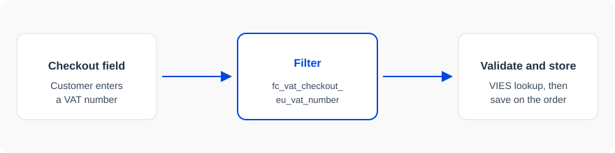

# Getting started with EU-VAT Assistant hooks

EU-VAT Assistant runs WordPress actions and filters around the checkout VAT number. Use them to normalize the number, turn a compatibility module on or off, or print something next to the field. You do not need to edit the plugin.



## Find a hook

The [hooks reference](/eu-vat/hooks) lists every action and filter exported from the plugin. Open a hook for its type, parameters, the version that introduced it, and the PHP file that runs it.

A filter such as [`fc_vat_checkout_eu_vat_number`](/eu-vat/hooks/fc_vat_checkout_eu_vat_number) receives the current value and must return a replacement. An action is a point where you can print markup or run a side effect.

## Attach a callback

```php
add_filter( 'fc_vat_checkout_eu_vat_number', 'my_store_normalize_vat_number', 10, 2 );

/**
 * Strip spaces and uppercase the VAT number before validation.
 *
 * @param string $vat_number VAT number entered at checkout.
 * @param string $country    Billing country code.
 * @return string
 */
function my_store_normalize_vat_number( $vat_number, $country ) {
    unset( $country );
    return strtoupper( preg_replace( '/\s+/', '', (string) $vat_number ) );
}
```

The last argument to `add_filter` is the number of parameters you accept. Match it to the parameters table on the hook page.

## Dynamic hook names

Some calls build the hook name in PHP. These docs rewrite that expression into a readable name. A variable becomes a `{placeholder}` segment, and `self::$plugin_prefix` is replaced with the plugin prefix `fc_vat`.

| PHP expression | Name in these docs |
| --- | --- |
| `'fc_vat_enable_compat_plugin_' . $plugin_slug` | `fc_vat_enable_compat_plugin_{plugin_slug}` |
| `'fc_vat_' . $current_section . '_settings'` | `fc_vat_{current_section}_settings` |
| `self::$plugin_prefix . '_admin_notices'` | `fc_vat_admin_notices` |

Register the concrete hook when you know the value:

```php
$plugin_slug = 'woocommerce-subscriptions';
add_filter( "fc_vat_enable_compat_plugin_{$plugin_slug}", '__return_false' );
```

## Where the pages come from

Hook pages under `/eu-vat/hooks/` are generated. Guides in this folder are written by hand. The hook list on this site is still a small sample, used so the docs build before the plugin publishes its real export. Use the pages to learn the format. The names will be replaced when that export lands.

Code samples in this guide are MIT licensed. The prose is all rights reserved. See the site footer for both.
