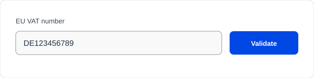

Strip spaces from the checkout VAT number before EU-VAT Assistant validates it.



```php
add_filter( 'fc_vat_checkout_eu_vat_number', function ( $vat_number, $country ) {
    if ( 'DE' !== $country ) {
        return $vat_number;
    }

    return preg_replace( '/\s+/', '', (string) $vat_number );
}, 10, 2 );
```
